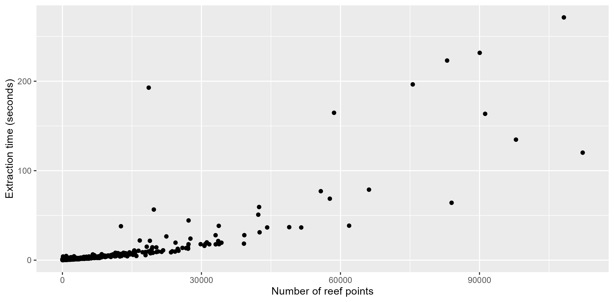
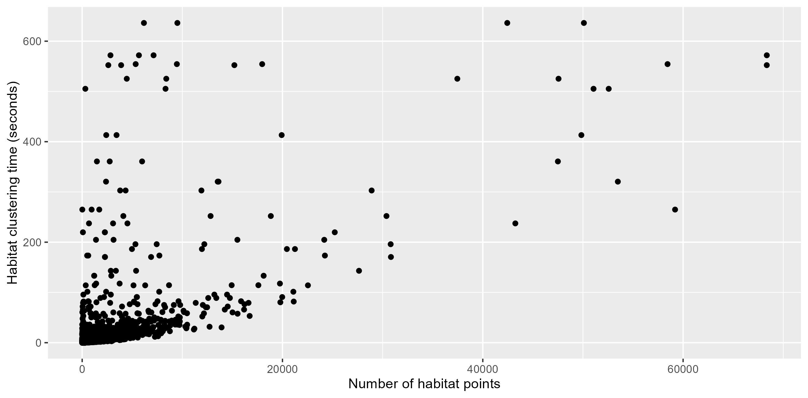
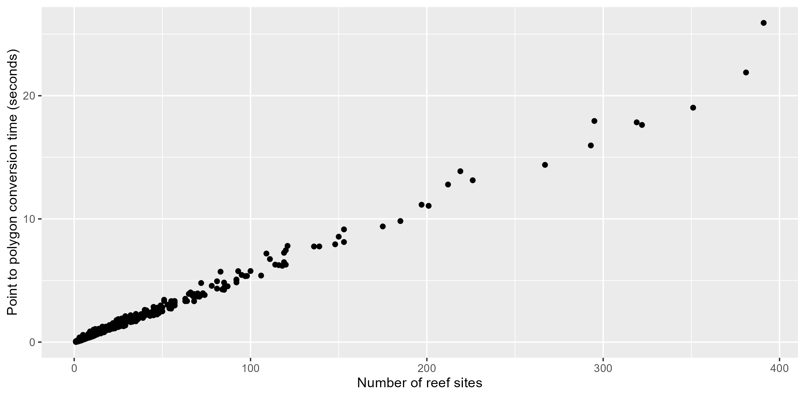
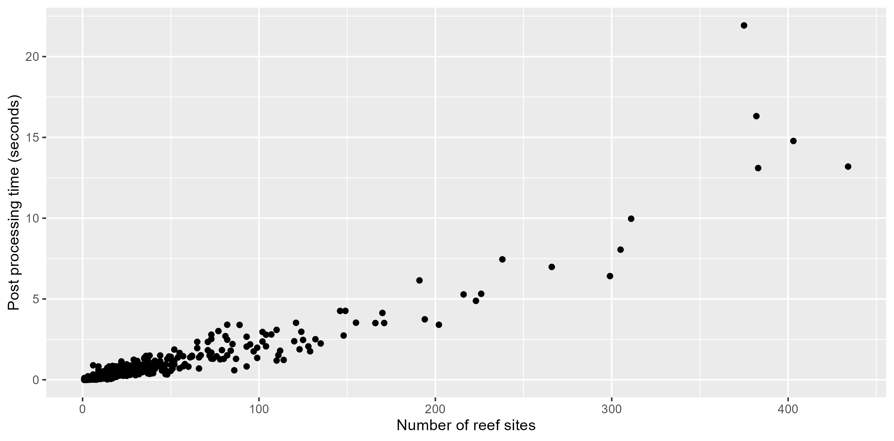

# Function benchmarking

ReefPartitionUniversal workflow steps have been benchmarked using GBRMPA
10m resolution data for the Mackay-Capricorn management area of the
Great Barrier Reef, Australia. This includes 827 reefs of varying sizes
with valid data. Benchmarking was performed using a raster resolution of
10m and a H3 hexagon resolution of 12 (307.092m² cell area).

## Point extraction

Point extraction was benchmarked for reefs using the `H3` cell method
`extract_point_cells`. Point extraction time was recorded once per reef
in seconds. The mean extraction time was 5.34 seconds, with a maximum of
271.31 seconds. Extraction time increases with the number of points
extracted, reaching 1 minute at between 50-60,000 points.

Time taken for execution for each reef (827 reefs) in seconds, with the
number of extracted points for each reef displayed on the x axis.

## Point clustering

Point clustering was benchmarked using the fast-skater algorithm with
Minimum Spanning Tree (MST) inputs. This used the default arguments of
`cluster_reef_points`. This includes an interpolation threshold where
for any habitat with \> 30,000 points, a random sample of 30,000 is
drawn for clustering with the remaining points being allocated clusters
using k nearest neighbour classification. Clustering time was recorded
separately for each habitat type (the simplest clustering units) within
each reef. Clustering time displays much more variation than extraction
time, likely reflecting it’s dependence on the spatial complexity of the
habitat points and the MST inputs; as well as the use of a 30,000 point
interpolation threshold.

Time taken for clustering of points for each habitat type within each
reef, with the number of points in a habitat displayed on the x axis.

## Point to polygon conversion

Point to polygon conversion time was benchmarked for each reef using
`cells_to_polygons` to convert clustered H3 cells into site polygons,
recording the number of sites per reef and the time taken in seconds.
Conversion time increases linearly with the number of sites on the reef,
reaching a maximum of 25.9 seconds.

Time taken for conversion of clustered site points into site polygons
for each reef, with the number of sites per reef displayed on the x
axis.

## Post processing

Reef post-processing was performed for each of the resulting polygonised
reefs. This step removes sites that are too small or too far away from
other polygons within their site ID. Post processing time largely holds
a linear relationship with the number of sites on a reef, with a maximum
time of 21.92 seconds.

Time taken for reef site polygon post processing with the number of
resulting sites displayed on the x axis. (Note that the maximum number
of sites has increased compared to the conversion benchmarking step due
to some sites being partitioned into smaller sites if their internal
distances between polygons are above the threshold of 100m).
